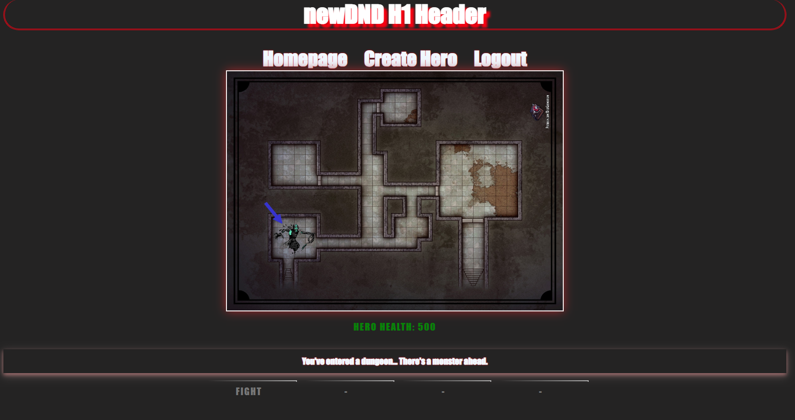

    
# newDND

## Table of Contents
* [Project Description](#description)
* [Installation](#install)
* [Contribution Notes](#contribution)
* [Usage Info](#usage)
* [Test Info](#test)
* [Contact Info](#contact)
* [Deployed Link](#deployed)
* [Screenshot](#screenshot)

## Description
A Heroku deployed application that utilizes DB management and Javascript functionality along with NPM packages to create a Dungeon Crawler game

## Install
A Web broweser and internet connection is all that is needed

## Contribution
Please review package-lock.json and developer links

## Usage
Public

## Test
NaN

## Contact
If you have any Questions or concerns please reach us via E-mail or through GitHub  
Ravi Nagi - rasvindra@hotmail.com /
[github.com/rasvindra](https://github.com/rasvindra) 
Parker Mathis - parkerjmathis@gmail.com /
[github.com/markerpathis](https://github.com/parkermathis) 
Arturo Serrato - arturo.serrato@yahoo.com /
[github.com/ArturoSer](https://github.com/ArturoSer) 
Jayden Chapman - jaychapmancode@gmail.com /
[github.com/deafboi6](https://github.com/deafboi6) 

## Deployed
https://new-dnd7.herokuapp.com

## Screenshot

